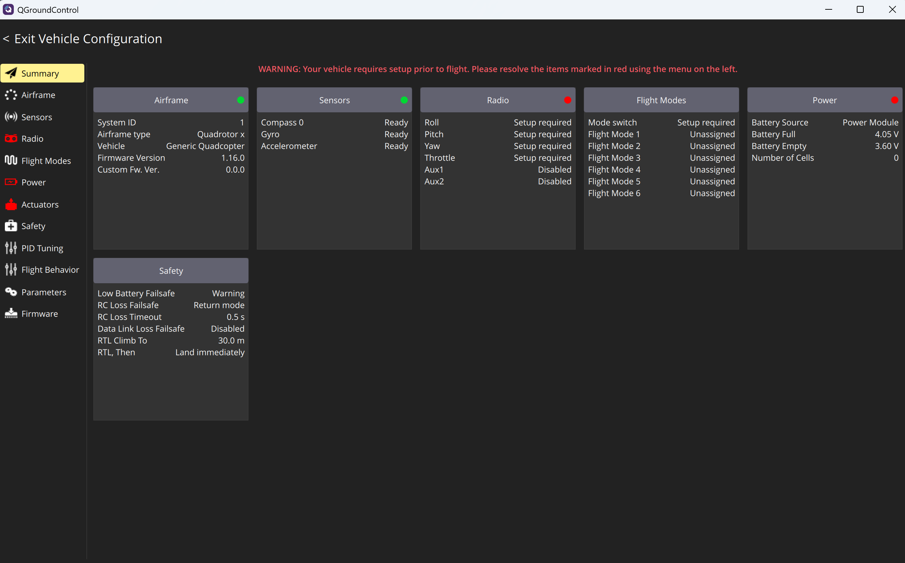
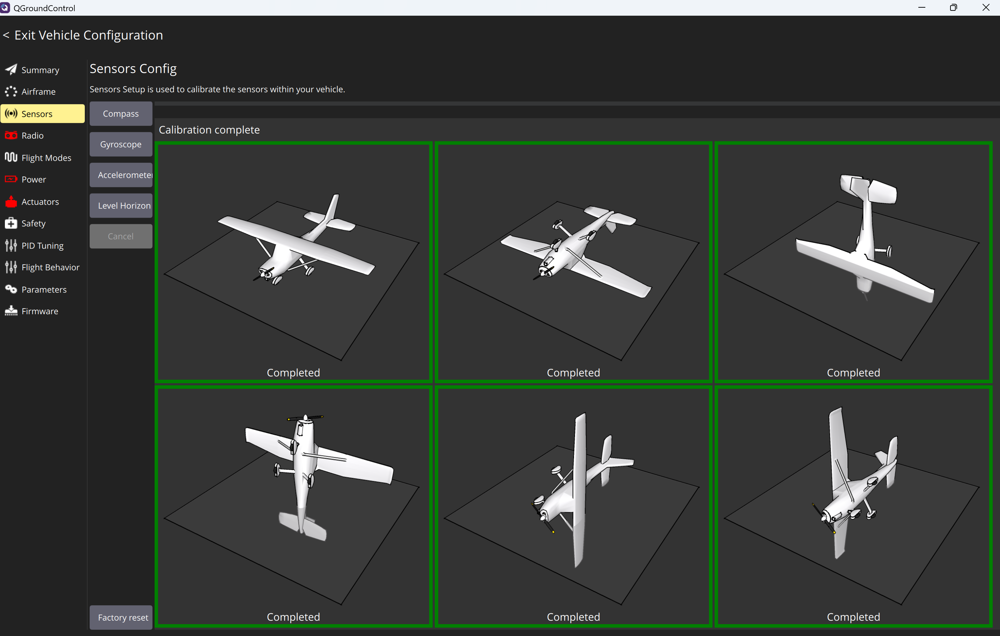
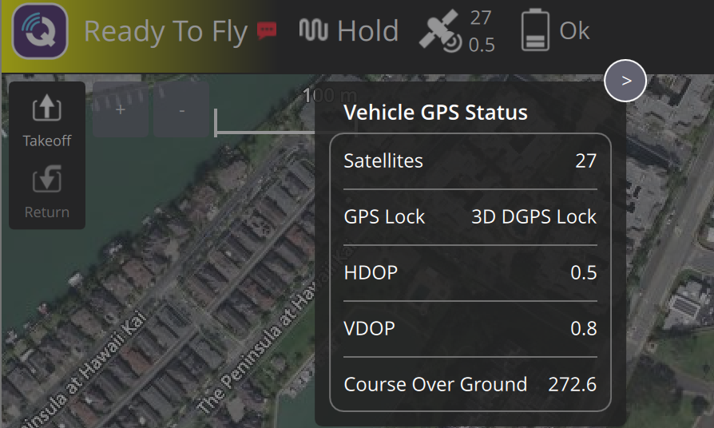
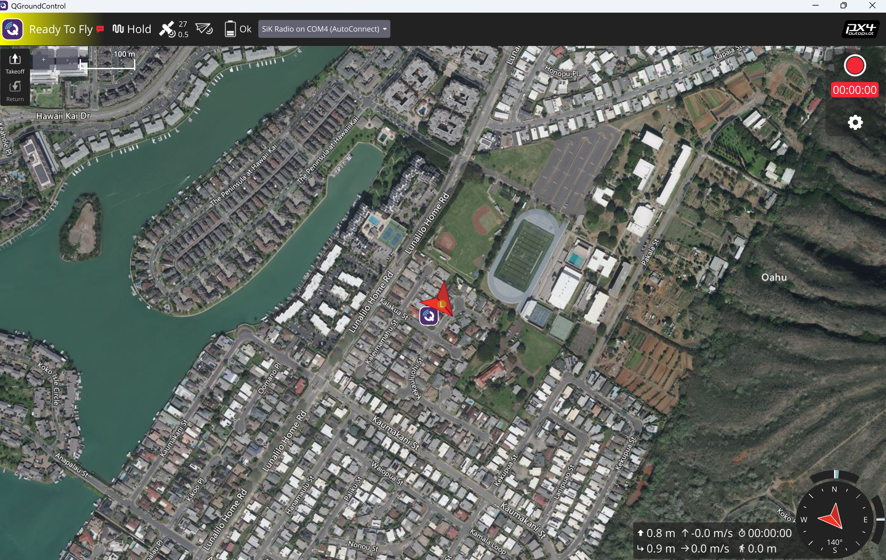
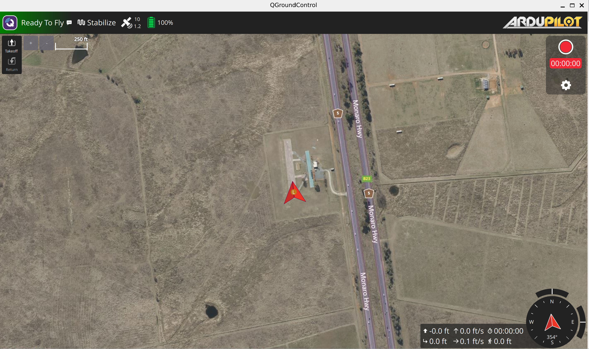
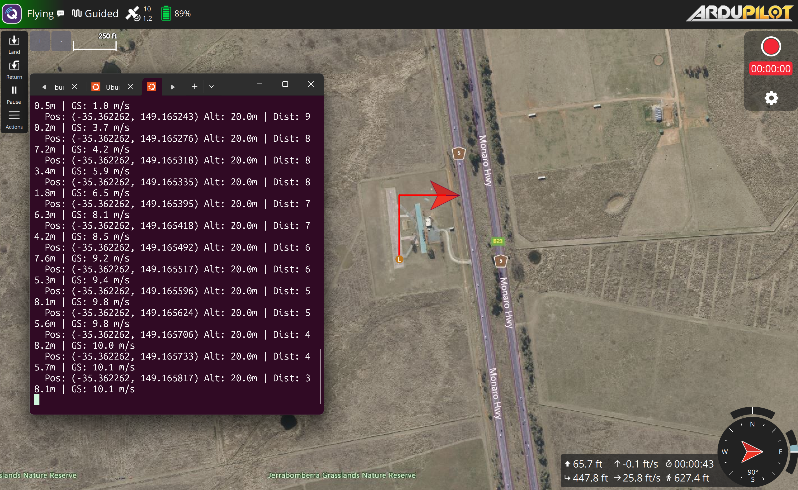

# UAS Systems Lab

A personal systems integration and autonomy lab built around ArduPilot SITL, MAVLink, and Python-based autonomous flight scripting. The focus is field-realistic troubleshooting, telemetry path validation, and autonomous mission development; skills directly applicable to operating software-enabled UAS platforms in austere environments.

The overall objective is to build practical engineering understanding of how autonomous systems are integrated, validated, monitored, and supported in operational environments. The project is intended to mirror the progression from simulation and systems validation into deployable autonomous system workflows similar to those used in modern UAS, robotics, and defense autonomy environments.

---

## Lab Architecture

```
ArduPilot SITL (ArduCopter)
        |
        |  MAVLink (TCP 5760)
        v
    MAVProxy
        |
        |  UDP outputs
       / \
      v   v
QGroundControl     Python MAVLink Scripts
   (14550)              (14551)
(GCS / visualization)  (autonomous missions, telemetry, beacon follower)
```

---
## System in Operation

**Hardware — Pixhawk 6C Mini bench integration:**

Pixhawk connected to QGC via USB, ArduPilot 1.16.0 confirmed:


All sensors calibrated — accelerometer, gyroscope, external M10 GPS compass:


M10 GPS 3D lock — 27 satellites, 0.5 HDOP, external compass set as primary:


QGC "Ready To Fly" over SiK radio wireless link — Pixhawk on wall power, no USB tether:


**Simulation — ArduPilot SITL:**

QGroundControl connected with simulated vehicle on map, telemetry active:


Guided waypoint mission executing — live position, groundspeed, altitude, and distance-to-waypoint telemetry:


---

## Demonstrated Capabilities

**Hardware Integration:**
- Pixhawk 6C Mini bench setup — ArduPilot firmware confirmed, full sensor calibration completed
- Holybro M10 GPS integration — 3D lock confirmed with 27 satellites, 0.5 HDOP, external compass set as primary
- SiK Telemetry Radio V3 wireless link — QGC "Ready To Fly" over COM4 with Pixhawk on wall power, no USB tether
- COM port driver troubleshooting and SiK radio pairing on Windows

**Simulation (SITL):**
- Autonomous waypoint mission execution in SITL
- MAVLink telemetry flow over UDP. Validated end-to-end from SITL to GCS and Python scripts
- Python-based beacon-follow state machine with keyboard operator override
- Staged descent logic: follow → approach → descend high → descend low → land
- Swappable GPS beacon input layer: simulated, UDP, and serial/NMEA
- Structured telemetry logging to CSV (replayable for post-flight analysis)
- Config-file-driven parameters. No hardcoded values in mission scripts
- Safe shutdown handling: Ctrl-C triggers RTL instead of hard exit
- Linux service, log, and network troubleshooting in Ubuntu/WSL environment

---

## Repository Structure

```
UAS-systems-lab/
├── configs/          # YAML config files for mission parameters and connection settings
├── diagrams/         # Lab architecture and data flow diagrams
├── docs/             # Setup guides, startup workflow, and troubleshooting references
│   ├── hardware_setup_guide.md    # Pixhawk, GPS, SiK radio bench integration
│   ├── lab_environment.md         # Host system and environment reference
│   ├── startup_workflow.md        # SITL startup and shutdown procedure
│   ├── telemetry_architecture.md  # MAVLink telemetry flow documentation
│   └── troubleshooting_guide.md   # Common faults and corrective actions
├── logs/             # Telemetry logs from completed SITL sessions. Proof of working system
├── missions/         # Waypoint mission files
├── networking/       # Network topology notes and MAVProxy routing configs
├── screenshots/      # GCS and terminal screenshots from lab sessions
├── scripts/          # Python MAVLink scripts
│   └── beacon_follower.py   # Autonomous beacon-follow state machine
├── .gitignore
├── LICENSE
├── README.md
└── requirements.txt
```

---

## Quickstart (SITL)

**Requirements:**
- Ubuntu 20.04+ or WSL2
- ArduPilot cloned to `~/ardupilot`
- MAVProxy installed (no venv)
- QGroundControl AppImage in home directory
- Python 3.10+ with project venv at `~/drone-control/venv`

**Install Python dependencies:**
```bash
cd ~/drone-control
source venv/bin/activate
pip install -r requirements.txt
```

**Startup order — open four terminals:**

**Terminal 1 — SITL (no venv):**
```bash
cd ~/ardupilot/ArduCopter
../Tools/autotest/sim_vehicle.py -v ArduCopter -f quad --no-mavproxy
```
> Wait for `SERIAL0 on TCP port 5760` before continuing.

**Terminal 2 — MAVProxy (no venv):**
```bash
mavproxy.py --master=tcp:127.0.0.1:5760 --out=127.0.0.1:14550 --out=127.0.0.1:14551
```
> Wait for `online system 1` before continuing.

**Terminal 3 — QGroundControl (no venv):**
```bash
LIBGL_ALWAYS_SOFTWARE=1 ./QGroundControl-x86_64.AppImage
```
> Vehicle should appear on map automatically via port 14550.

**Terminal 4 — Python scripts (project venv only):**
```bash
cd ~/drone-control
source venv/bin/activate
python heartbeat_test.py                                              # verify connection first
python scripts/beacon_follower.py --config configs/config.yaml       # run mission
```

**Port layout:**
```
MAVProxy → 14550 → QGroundControl
MAVProxy → 14551 → Python scripts
```
> Never run QGroundControl and Python scripts on the same port — they will conflict.

**Shutdown order (reverse startup):**

| Terminal | Action |
|---|---|
| 4 — Python | `Ctrl+C` then `deactivate` |
| 3 — QGroundControl | Close window normally |
| 2 — MAVProxy | `Ctrl+C` |
| 1 — SITL | `Ctrl+C` |

---

## Beacon Follower

The primary mission script (`scripts/beacon_follower.py`) implements a state machine for autonomous beacon tracking with operator override.

**States:**

| State | Behavior |
|---|---|
| `FOLLOW_BEACON` | Tracks a moving GPS beacon at cruise altitude |
| `HOLD_POSITION` | Locks to current position on operator command |
| `DESCEND_ON_BEACON` | Staged descent: approach → high waypoint → low waypoint → land |
| `RETURN_TO_LAUNCH` | RTL on operator command |
| `LAND` | Immediate land command |

**Beacon sources** (configured in `configs/config.yaml`):

| Source | Description |
|---|---|
| `simulate` | Circular motion around home. Used for SITL testing |
| `udp` | Listens for `lat,lon` datagrams on a configurable port |
| `serial` | Reads NMEA GGA/RMC sentences from a GPS receiver over UART |

**Operator commands** (keyboard, non-blocking):
```
f  — follow beacon
h  — hold position
d  — descend on beacon
r  — return to launch
l  — land
q  — quit script
```

**Replay a previous telemetry log:**
```bash
python scripts/beacon_follower.py --replay logs/telem_20260510_142301.csv
```

---

## Configuration

All tunable parameters live in `configs/config.yaml` — no hardcoded values in mission scripts:

```yaml
connection:
  uri: "udpin:127.0.0.1:14551"   # Change to serial:///dev/ttyUSB0:57600 for hardware

home:
  lat: -35.363262
  lon: 149.165237

altitudes:
  takeoff: 20
  follow: 20
  descend_high: 12
  descend_low: 5

follow:
  radius_m: 8
  update_rate_sec: 1

beacon:
  source: "simulate"   # simulate | udp | serial

logging:
  log_dir: "logs"
  level: "INFO"
```

---

## Common Failures

| Symptom | Likely Cause | Fix |
|---|---|---|
| `Connection refused` | SITL not ready or port 5760 not open | `ss -tlnp \| grep 5760`; wait for SITL to fully initialize before launching MAVProxy |
| QGroundControl "Communication Lost" | Python script on wrong port | Confirm Python uses 14551, QGC uses 14550: they must not share a port |
| MAVProxy missing modules | Dependency gap | `python3 -m pip install --user MAVProxy future --break-system-packages` |
| venv active in wrong terminal | Environment bleed | SITL, MAVProxy, QGC = no venv. Python scripts = project venv only |
| Vehicle not arming | Pre-arm checks failing | Check GPS lock and telemetry values in QGC before running scripts |

---

## Documentation

| Document | Description |
|---|---|
| [docs/hardware_setup_guide.md](docs/hardware_setup_guide.md) | Pixhawk, GPS, and SiK radio bench integration |
| [docs/startup_workflow.md](docs/startup_workflow.md) | SITL startup, shutdown, and port layout |
| [docs/telemetry_architecture.md](docs/telemetry_architecture.md) | MAVLink telemetry flow — SITL and hardware paths |
| [docs/lab_environment.md](docs/lab_environment.md) | Host system and environment reference |
| [docs/troubleshooting_guide.md](docs/troubleshooting_guide.md) | Common faults and corrective actions |

---

## Roadmap

### Near-Term
- [ ] Integrate serial NMEA beacon input and validate against hardware GPS receiver
- [ ] Add geofence boundary enforcement to state machine
- [ ] Expand to multi-waypoint patrol mission with beacon hand-off
- [ ] Add MAVLink parameter push/pull via script for pre-flight configuration
- [ ] Mission failover logic — automated RTL/loiter on link loss or fence breach

### Hardware Integration
- [x] Hardware flight controller integration (Pixhawk 6C Mini — ArduPilot 1.16.0, full sensor calibration)
- [x] Telemetry radio integration (SiK V3 — wireless QGC link validated, Ready To Fly confirmed)
- [ ] Companion computer workflows using Raspberry Pi
- [ ] Multi-system telemetry routing across hardware and GCS

### Autonomy Expansion
- [ ] Dynamic waypoint generation based on sensor or beacon input
- [ ] Search-pattern automation (lawnmower, expanding spiral)
- [ ] GPS target tracking with real beacon hardware
- [ ] Autonomous return and loiter behaviors
- [ ] Real-time telemetry analysis and anomaly detection

### Long-Term

---

## Stack

| Component | Tool |
|---|---|
| Flight Controller | Pixhawk 6C Mini (ArduPilot 1.16.0) |
| GPS | Holybro M10 GPS (external compass, primary) |
| Telemetry Radio | SiK Telemetry Radio V3 (air + ground) |
| GCS | QGroundControl (Windows) |
| Autopilot (sim) | ArduPilot (ArduCopter) |
| Simulation | SITL via `sim_vehicle.py` |
| Telemetry (sim) | MAVLink over UDP via MAVProxy |
| Scripting | Python 3, pymavlink, pyserial, PyYAML |
| Environment | Ubuntu 24.04 / WSL2, Windows |
